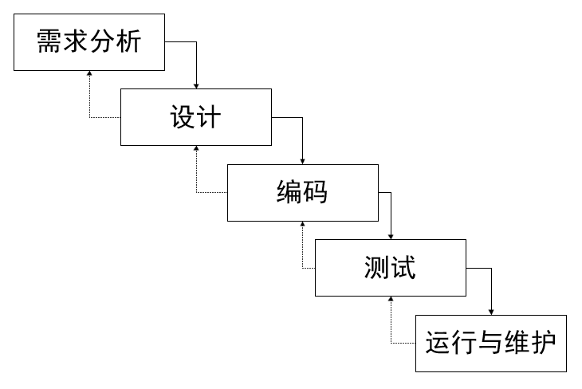
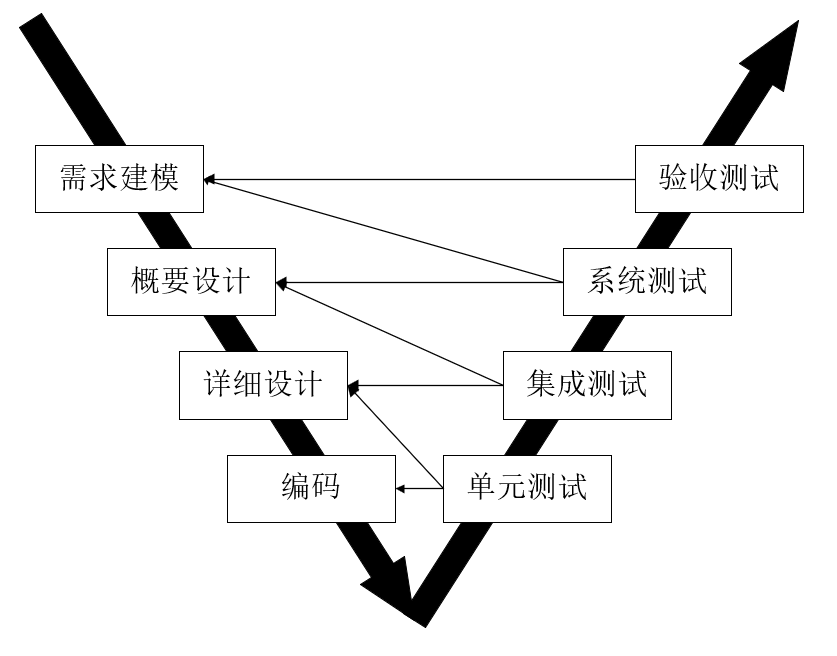

# 概述
软件工程为解决计算机软件危机而产生。

软件工程是指应用在计算机科学、数学及管理科学等原理。以工程化原则和方法解决软件问题的工程。

包括软件开发技术和软件工程管理等

## 计算机软件
指计算机系统中的程序和文档。

按照应用领域分，有十大类：
- 系统软件
- 应用软件
- 工程/科学软件
- 嵌入式软件
- 产品线软件
- Web应用
- 人工智能软件
- 开放计算
- 网络资源
- 开源软件

## 软件工程基本原理
7大基本原理，需要严格遵守。
- 用分阶段的生命周期计划严格管理
- 坚持进行阶段评审
- 实现严格的产品控制
- 采用现代程序设计技术
- 结果应能清楚的审查
- 开发小组的人员应少而精
- 承认不断改进软件工程实践的必要性

## 软件生存周期
- 可行性分析与项目开发计划
- 需求分析
- 概要设计
- 详细设计
- 编码
- 测试
- 维护

## 软件过程
三层含义
- 个体含义
- 整体含义
- 工程含义

1. 能力成熟度模型（CMM）：评价软件承接方能力的方法。

    五大级别：

    - 初始级
    - 可重复级
    - 已定义级
    - 已管理级
    - 优化级
    软件过程评价主要采用的是成熟度调查表。

2. 能力成熟度模型集成（CMMI）

两种表示方法：
1. 阶段式模型
   - 初始的
   - 已管理的
   - 已定义的
   - 定量管理的
   - 优化的
2. 连续式模型
   - CL0（未完成）
   - CL1（已执行）
   - CL2（已管理）
   - CL3（已定义）
   - CL4（定量管理）
   - CL5（优化的）

# 软件过程模型
有时也称作软件开发模型
## 瀑布模型
   
    按照线性顺序，将各种步骤按照次序进行下去
    变体：V模型。保证了质量的流通。
   
    优点：容易理解，管理成本低，强调阶段性
    不足：容易超出预算，难以评估软件的真正状态。
## 增量模型
融合了瀑布模型的基本成分和实现的迭代特征，以增量为单位，将软件慢慢交付。

优点： 第一个可交付版本实践少，开发的增量风险不大。可以减少用户需求的变更；项目开始时，可以仅对一个或两个增量投资。

不足：没有对用户变更的需求进行规划；初始增量与后来增量变化会不稳定；需求如果不像早期思考的那样稳定和完整，那么一旦增量就可能需要重新开发，重新发布；管理发生的成本、进度和配置的复杂性可能会超出组织的能力

## 演化模型
迭代的过程的模型，包括原型模型和螺旋模型。

原型模型：对于用户需求不清楚的情况下，通过当系统规模需求不是很大也不太复杂时采用的方法。且需求不清的情况。
原型模型可以分成探索型原型、实验型原型和演化型模型三种。

螺旋模型：将开发分成几个螺旋周期，每个螺旋周期与瀑布模型相符合。
四个工作步骤：制定计划、风险分析、实施工程、用户评估

它支持用户需求的动态变化，为用户参与软件的开发的所有关键决策提供了方便，有助于提高软件的适应能力。降低了软件开发风险。需要开发人员有相当丰富的开发知识和风险评估经验。另外，过多的迭代次数会增加开发成本。

## 喷泉模型
以用户需求为动力，以对象作为驱动的模型，适合于面向对象的开发方法。克服了瀑布模型不支持软件重用和多项开发活动集成的局限性

可以提高软件开发效率，节省开发时间。由于喷泉模型在各个开发阶段是重叠的，要求开发过程中需要大量的开发人员，且需要大量的开发文档。审核难度加大。

## 基于构件的开发模型
使用预先包装的构件来构造应用系统。构建可以是组织内部开发的构件，也可以是商品化成品构件。本质上是演化模型。通过预先打包的软件开发应用系统。

## 形态化方法模型
建立在严格数学基础上的一种软件开发方法。是生成计算机软件形式化的的数学规格说明。

## 统一过程模型
“用例和风险驱动，以架构为中心，迭代并且增量”的开发过程，由UML方法和工具支持。

四个技术阶段：
- 起始阶段
- 精化阶段
- 构建阶段
- 移交阶段

典型代表：RUP。
## 敏捷方法
尽早且有持续化地对有价值的软件的交付

理念
1. 极限编程
   - 四大价值观
   - 五个原则
   - 十二个最佳实践
2. 水晶法
3. 并列征求法
4. 自适应软件开发
5. 敏捷统一过程
   - 建模
   - 实现
   - 测试
   - 部署
   - 配置及项目管理
   - 环境管理